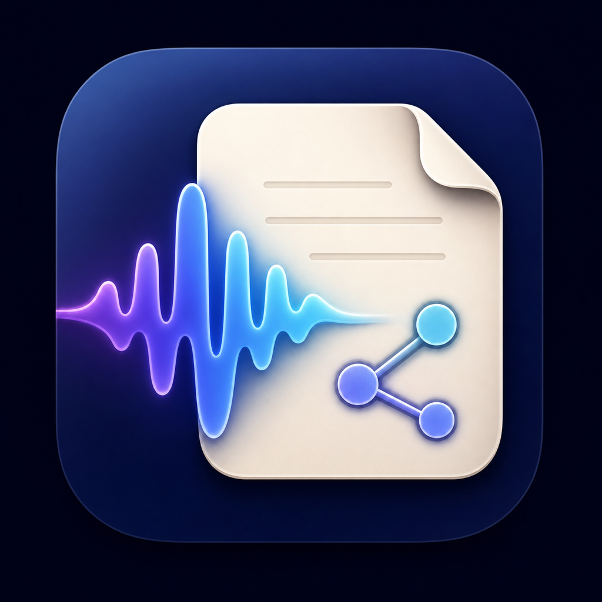
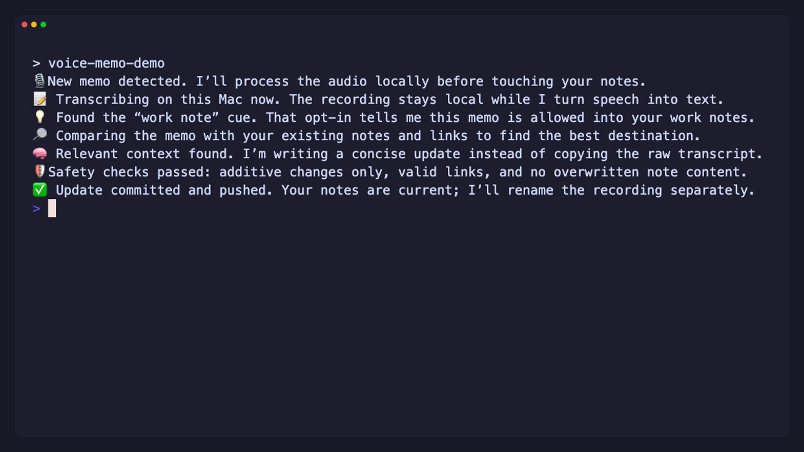

<p align="center">
  
</p>

# Voice Memo Notes Agent

An event-driven macOS workflow that turns selected Apple Voice Memos into contextual notes in a private Markdown/Foam vault.

Record on an iPhone, let iCloud sync the memo to the Mac, and say a routing phrase such as **"work note"**, **"for work"**, or **"work memo"**. A locally signed background app detects the recording and runs a deterministic local pipeline. Codex is invoked only after local transcription and exact work-trigger qualification, and only to title and place the note content.

## Demo

[](assets/voice-memo-agent-demo.mp4)

The MP4 previews the seven explanatory messages emitted during a qualified direct-publish memo run. The linked [VHS tape](assets/voice-memo-agent-demo.tape) records the same stream live; click the image to play the 12-second demo.

## Architecture

```mermaid
flowchart LR
    A["iPhone Voice Memos"] -->|"iCloud sync"| B["Voice Memos on Mac"]
    B -->|"new .m4a event"| C["Locally signed Voice Memo Agent"]
    C --> D["Deterministic sync CLI"]
    D --> E["Read-only Voice Memos adapter"]
    E --> F["Embedded transcript or Apple Speech"]
    F --> G{"Exact work trigger found?"}
    G -->|"No"| H["Mark ignored locally"]
    G -->|"Yes"| I["Vault map + candidate retrieval"]
    I --> J["Constrained Codex edit plan"]
    J --> K["Deterministic plan application + validation"]
    K --> L["Commit to per-memo review branch"]
    L --> M["Review and merge in private GitHub notes repository"]
    L --> N["Immediate Pushover review notification"]
    N --> O["Independent Voice Memos rename retry"]
    O -->|"UI unavailable"| P["Retry after wake or unlock"]
    P --> O
```



## What It Does

- Watches the iCloud-synced Voice Memos recording directory with FSEvents.
- Debounces arrivals and queues one follow-up when a memo appears during a run.
- Uses an embedded Apple transcript when available, then falls back to Apple's on-device `SpeechAnalyzer`.
- Imports only memos containing a configured opt-in work phrase with token-boundary matching.
- Avoids any Codex call for no-op, baseline, ignored, lease-blocked, and rename-only runs.
- Gives Codex one constrained semantic planning call in a tiny read-only workspace, including resolved link and backlink context for candidate notes.
- Gives Codex a capped vault map, Foam guidance, and capped content from the strongest candidate notes, using corpus-aware weighting so specific people and projects outrank generic terms; Codex returns a structured plan that Python applies and validates.
- Generates a concise title and queues a best-effort rename through the Voice Memos UI, using recording date and duration to disambiguate generic titles.
- Searches a Foam vault and chooses an existing note, daily journal, new note, or linked notes.
- Treats journals as capture and durable notes as an associative graph; newly created non-journal notes must connect to the existing Foam graph.
- Routes Saturday and Sunday journal entries to the following Monday instead of creating weekend journals.
- Adds a hidden `voice-memo-id` marker for recovery and duplicate prevention.
- Allows only additive Markdown changes across at most five files per memo.
- Pushes each memo to a unique review branch by default; after merge, reconciliation records completion without another model call. Existing pre-v4 installations retain direct-push mode until changed.
- Sends a minimal Pushover notification after success and a privacy-safe memo-ID/stage alert for actionable import failures.
- Keeps imports and notifications successful when the Mac is locked, then retries pending renames after wake or session activation.

## Requirements

- macOS 26 or later for the included Apple Speech helper
- Apple Voice Memos with iCloud sync enabled
- Codex desktop app and CLI
- Git, GitHub CLI, Node.js 18+, npm, Swift, Python 3.9+, `jq`, `rg`, and SQLite
- A dedicated private GitHub notes repository with a checked-out default branch

The bootstrap pins [`apple-voice-memo-mcp`](https://github.com/jwulff/apple-voice-memo-mcp) to Git commit `f34437f546f17c78989b6e1a248d452829e50754` (whose package manifest is `0.1.0`), plus the compatibility patch stored in this repository.

## Builds

Every pull request produces ad hoc-signed Apple Silicon, Intel, and universal macOS app archives. Published releases attach the same three archives, a SHA-256 checksum manifest, and GitHub build-provenance attestations. The checked-in icon source and `.icns` bundle live in [`assets/`](assets/).

These CI builds are for inspection and testing. They are not Developer ID signed or Apple notarized, so Gatekeeper-ready production installation still uses the source bootstrap and its persistent local signing identity. Build locally with:

```bash
./scripts/build_app.sh --output-dir dist --architecture universal --archive
```

## Install

```bash
gh repo clone OWNER/voice-memo-notes-agent ~/Documents/voice-memo-notes-agent
cd ~/Documents/voice-memo-notes-agent
./scripts/install-skill.sh
export VOICE_MEMO_NOTES_REPOSITORY="owner/private-notes"
export VOICE_MEMO_NOTES_REPO_DIR="$HOME/Documents/private-notes"
# Optional: defaults to the repository's default branch.
export VOICE_MEMO_NOTES_BRANCH="main"
./scripts/bootstrap.sh
./scripts/doctor.sh
```

The notes repository is intentionally required on first install; the project contains no personal vault default. Bootstrap is idempotent and reuses the repository path from an existing LaunchAgent during upgrades. It builds and locally signs `/Applications/Voice Memo Agent.app`, registers the pinned MCP server, prepares the notes checkout, initializes local state, and installs `~/Library/LaunchAgents/com.nrgapple.VoiceMemoAgent.plist`. Advanced source-only deployments may provide `VOICE_MEMO_SIGNING_IDENTITY` instead of creating the local identity.

## macOS Permissions

Grant **Full Disk Access** to the Codex/ChatGPT desktop app and **Voice Memo Agent**. Grant **Accessibility** to **Voice Memo Agent** so it can rename recordings. The MCP reads the Voice Memos database; title changes go through the visible Voice Memos application rather than direct database writes.

Request Accessibility after bootstrap:

```bash
/Applications/Voice\ Memo\ Agent.app/Contents/MacOS/VoiceMemoAgent --request-accessibility
```

Then rerun `./scripts/doctor.sh`. Restart the Codex desktop app after MCP or privacy changes.

## Work Triggers

The default phrases are:

```text
work note
work notes
for work
work memo
memo for work
note for work
```

They live in the local vault's `.voice-memo-automation/config.json`. The phrase controls routing and is omitted from the resulting note unless it has independent meaning.

## Runtime

The LaunchAgent is the primary trigger. It responds only to the first appearance of a new `.m4a`, waits a two-second event debounce, then checks file stability and Voice Memos database visibility before processing. Startup and six-hour reconciliation runs cover coalesced or missed filesystem events. Wake, screen-wake, and active-session events also reconcile queued renames. A lightweight Codex automation can provide a separate 12-hour recovery check.

The CLI directly uses the pinned Voice Memos library for listing and transcription. It owns leases, caching, trigger qualification, weekend routing, retry state, temporary worktrees, validation, commits, pushes, and structured results. `codex exec` starts only for a qualified memo, ignores global MCP and rule configuration, and cannot access the automation state or primary checkout through its workspace sandbox. Transcripts, vault maps, graph context, model prompts, and subprocesses all have explicit limits and timeouts.

Fresh installations use `publish_mode: review`. A qualified memo is pushed to `voice-memo/review-<memo-id>-<sha>` and remains `awaiting_review` until that commit is merged into the configured target branch. Reconciliation then marks the memo complete and queues its rename without invoking Codex again. Set `publish_mode` to `direct` in the local config only if unattended writes to the target branch are an accepted policy for that private vault.

The Mac must be awake and logged in. Import state, logs, cached transcripts, and failures are stored under the notes checkout's `.voice-memo-automation/` directory and excluded with `.git/info/exclude`.

For a terminal demo, trail the separate conversational log before recording a new memo:

```bash
tail -n 0 -F "$VOICE_MEMO_NOTES_REPO_DIR/.voice-memo-automation/agent-demo.log"
```

This log stays quiet during startup and reconciliation. A newly detected recording starts a timestamp-free, emoji-led explanation of local transcription, opt-in qualification, note selection, contextual drafting, safety checks, and delivery. Messages are written at least 1.5 seconds apart so they remain readable in VHS captures. It contains no transcript, note content, filename, memo ID, run ID, command output, or credentials; the existing JSONL logs remain unchanged for diagnostics and benchmarks.

## Notifications

Install Pushover on the iPhone, create a Pushover application, and obtain its User Key and API Token. Then run:

```bash
./scripts/configure_pushover.sh
./scripts/configure_pushover.sh pushover-test
```

The first command opens two native prompts. Copy each requested value and click `Use Clipboard`; the app reads it without displaying it and immediately clears the clipboard. The signed app stores both values in `~/.config/voice-memo-agent/pushover.json`, owned by the current user with mode `0600`. Values never appear in command arguments, LaunchAgent environment values, Codex prompts, logs, or Git. Only the credentials-file path is configured in launchd, and the coordinator removes that path from the semantic Codex process environment.

Notifications are built from the coordinator's structured JSON. Review mode sends the memo ID, generated title, affected note paths, short commit reference, and GitHub comparison link; after merge, the normal success notification links to the commit. An actionable failure payload contains only the memo ID and failure stage, even when the coordinator exits nonzero; it excludes raw errors, paths, command output, transcript text, and note contents. The first failed import attempt alerts immediately and the third consecutive failure produces one escalation without notifying on every retry. Coordinator launch/result failures and watcher startup failures also produce generic runtime alerts; watcher startup alerts are limited to one per app lifetime. Rename alerts explicitly say the import already succeeded. Notification and rename failures are tracked independently and cannot retry or roll back a completed import.

Each run emits redacted JSONL telemetry with one run ID across watcher, coordinator, Codex, validation, publish, notification, and rename stages. It records timestamps, durations, queue counts, transcript source/cache status, candidate counts/character volume, and Codex token/tool totals. The separate `agent-demo.log` contains only generic conversational status messages. Command stdout, note contents, transcripts, audio, and prompts are never written to logs.

## Validate

```bash
python3 -m pip install -r requirements-dev.txt
./scripts/run_harness.sh fixture
./scripts/doctor.sh
```

`doctor.sh` checks CLI authentication, the pinned MCP build, local signing identity, app signature, Accessibility, Full Disk Access, launchd registration, notes checkout integrity, and local state.

## Product Improvement Harness

The repository includes a layered harness for safely improving latency, reliability, and note quality:

- `scripts/test_helpers.py` provides deterministic transaction, safety, routing, telemetry, and fixture-placement coverage.
- `scripts/doctor.sh` verifies the signed live runtime and its external dependencies.
- `scripts/benchmark.py` turns durable per-memo telemetry into a privacy-safe report, compares it with a saved baseline, validates the resulting Git commit, and enforces optional performance gates.
- a live canary memo and human review remain required for semantic placement changes; mocked model output cannot prove that a note is useful.

Run the deterministic harness, or include live runtime health checks:

```bash
./scripts/run_harness.sh fixture
./scripts/run_harness.sh live
```

Quick benchmark:

```bash
python3 scripts/benchmark.py \
  --repo "$VOICE_MEMO_NOTES_REPO_DIR" \
  --format markdown
```

See [`references/improvement-harness.md`](references/improvement-harness.md) for baseline commands, initial budgets, the note-quality rubric, and the release loop.

## Privacy And Safety

- Audio and raw transcripts never enter Git.
- Signing keys, notification credentials, app bundles, state, and logs are excluded from this repository.
- The notes checkout must be clean and fast-forwardable before edits.
- Imports never delete note content, rename note files, force-push, or overwrite conflicts.
- Paths that resolve outside the notes checkout, traverse symlinks, or enter blocked content directories are rejected.
- A memo is complete only after its commit is present on the configured remote target branch and its SHA is recorded locally.
- Personal or otherwise unqualified transcripts never enter Codex context.
- `codex exec` uses a tiny read-only semantic workspace; the signed app and deterministic CLI retain filesystem mutation, Voice Memos, state, Git, validation, and notification control.

More detail is available in [`SKILL.md`](SKILL.md) and [`references/`](references/).

## Public Release Status

This is a public beta under the MIT License with source and ad hoc-signed CI build artifacts. There is no Developer ID-notarized binary, hosted service, or support SLA. Production use requires a private test vault, successful fixture and live harness runs, a reviewed canary memo, backup and branch-protection policies for the notes repository, and monitoring of LaunchAgent/Pushover failures. See [`RELEASING.md`](RELEASING.md), [`SECURITY.md`](SECURITY.md), [`CONTRIBUTING.md`](CONTRIBUTING.md), and [`THIRD_PARTY_NOTICES.md`](THIRD_PARTY_NOTICES.md).

To remove the app, LaunchAgent, and skill link while preserving notes, local state, credentials, signing identity, and MCP checkout:

```bash
./scripts/uninstall.sh --confirm
```
